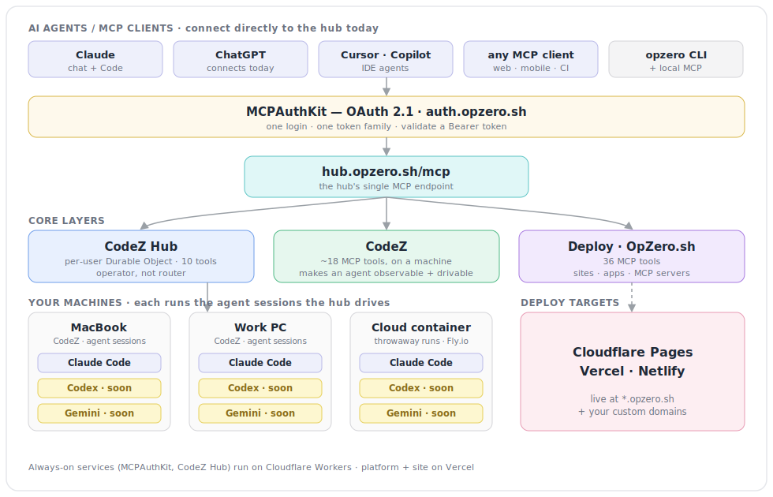

# OpZero

### → [**opzero.sh**](https://opzero.sh)

**The production layer for coding agents.**

Coding agents can write code. The hard part was never the writing — it's everything around it: authenticating the agent to your services, running it across the machines where your code actually lives, testing what it produced, watching what it's doing, and shipping the result to production. OpZero is the infrastructure that closes that gap, so an agent goes from "wrote the code" to "it's live, on your infra, with guardrails" — in one authenticated flow.

It's built as composable layers — auth, orchestration, deploy, test — each usable on its own, all converging on one product: **`code.opzero.sh`**, where you log in once, see every machine you own, pair-program with Claude (or any agent) across them, and deploy the result.

[](https://opzero.sh)
[](https://www.npmjs.com/package/opzero)
[](https://www.npmjs.com/package/@opzero/mcp)

---

## Three layers, one login

OpZero is the whole path from "talk to an agent" to "it's live on your domain" — three layers behind a single OAuth login:

- **Orchestrate — from your pocket.** Add `hub.opzero.sh/mcp` to **claude.ai, ChatGPT, Cursor, or any MCP client** and drive coding agents across every machine you own — from your phone, your laptop, or a browser tab. The orchestration layer is a hosted MCP endpoint, so the operator console is wherever your chat app is. No terminal required.
- **Generate — [CodeZ](https://github.com/OpZero-sh/CodeZ).** The code-gen layer. CodeZ turns Claude Code on each of your machines — and on **on-demand cloud containers (Fly.io)** — into an observable, remotely drivable session: spawn, prompt, approve permissions, stream output, and track cost from anywhere.
- **Deploy — OpZero.sh.** The same login ships the result to **Cloudflare Pages, Vercel, or Netlify** — on `*.opzero.sh` *or your own custom domains*, across multiple providers, in the same conversation.

---

## What this enables that the alternatives don't

The market has plenty of ways to *talk to a coding agent*. What's missing is the substrate that lets that agent operate on **your real machines** and **ship to production** — owned by you, not rented inside someone's sandbox. That's the gap OpZero fills.

| You're using… | What it gives you | What it can't do | What OpZero adds |
|---|---|---|---|
| **claude.ai** (web/mobile chat) | Claude + connectors in Anthropic's hosted sandbox | Can't touch your machines, your checked-out repos, your local toolchain or VPN | Add `hub.opzero.sh/mcp` as a custom connector and claude.ai reaches **into your actual machines** — drive Claude Code on your laptop and work PC, then deploy — all from the same chat |
| **Claude Code** (terminal) | A capable single-machine agent in one terminal | Sessions are local islands: no cross-device control, no fleet view, no shared cost/observability | The hub turns Claude Code into a **fleet** — orchestrate sessions across machines, observe and approve permissions from any device (including your phone), search history, track spend |
| **Cowork / hosted agent clouds** | Managed agents running in a provider's cloud | Runs on *their* infra and billing; your environment and data live elsewhere | Runs on **your** infra with **your** Claude Max subscription over OAuth — no per-token API billing, nothing phones home |
| **Open-source agents** (e.g. opencode) | A good agent runtime / TUI | It's the agent, not the production stack around it | OpZero is that stack: OAuth for MCP, multi-machine federation, a deploy platform, a test engine, shared data + context discipline — that **any** agent plugs into. Claude Code works today; **Codex and Gemini are coming soon** 🚧 |

The throughline: **OpZero isn't another agent. It's the layer that lets the agents you already use authenticate, run across your machines, test, observe, and ship — with one login, on infrastructure you control.** It's deliberately provider-neutral: Claude Code is wired up today, with **Codex and Gemini next** 🚧.

---

## The north star: `code.opzero.sh`

One origin, one OAuth, one operator console:

- **Log in once** via MCPAuthKit and land in your own per-user hub.
- **See every machine you own** — online/offline, specs, repos, live sessions.
- **Pair-program across them** — start, resume, fork, and observe agent sessions on any machine, from the web UI or any MCP client.
- **Ship the result** — the same connector exposes the deploy tools, so "build this on my laptop, then push it to Cloudflare" is a single conversation.

The pieces below already run as standalone layers; the active work (see the [roadmap](https://github.com/OpZero-sh/.github/blob/main/ROADMAP.md)) is consolidating them onto that single surface and opening it to agents beyond Claude Code — **Codex and Gemini are coming soon.**

---

## Endpoints

| Endpoint | Layer | What it's for |
|---|---|---|
| `code.opzero.sh` | Operator console | The north-star surface — log in once and land in your own per-user hub: see every machine you own, pair-program with Claude across them, and deploy the result. One origin over the orchestrate, code-gen, and deploy layers below. |
| `hub.opzero.sh/mcp` | CodeZ Hub | The hosted MCP connector — add it to any MCP client (Claude, ChatGPT, Cursor, Copilot, scripts) to reach every machine you own, plus on-demand cloud containers on Fly.io. Federates your CodeZ instances behind one OAuth-protected endpoint (10 tools: list/wake machines, create/drive/dispose sessions, poll events). |
| `auth.opzero.sh` | MCPAuthKit | OAuth 2.1 authorization server — discovery, dynamic client registration, authorize, token, and refresh. The single login and token family behind every other endpoint. |
| `opzero.sh` | Deploy platform | The deployment platform and dashboard, plus its 36-tool MCP server — ship sites, apps, and MCP servers to Cloudflare Pages, Vercel, or Netlify, and manage projects, custom domains, and rollbacks. |
| `*.opzero.sh` + custom domains | Deploy targets | Live URLs for everything you deploy through the platform — on `*.opzero.sh` or your own domains across any of the providers. |

> Provider-neutral by design: today these speak to Claude (chat + Code); **Codex, Gemini, and other agents are on the way** 🚧.

---

## The layers

### Orchestrate — drive agents across your machines

**[CodeZ](https://github.com/OpZero-sh/CodeZ)** — Claude Code, made observable and remotely drivable. It exposes your local Claude Code sessions as an MCP server, so any MCP client (claude.ai on iOS/desktop/web, ChatGPT, Cursor, Copilot, the CLI, a script) can spawn sessions, send prompts, approve permissions, stream output, and track cost — ~18 MCP tools in all. Mobile-first PWA with voice input, a subagent team grid, session search, and real-time streaming sits on top. Self-hosted, tunneled through Cloudflare, authenticated with your Claude Max subscription via OAuth — nothing phones home. *(CodeZ is the public distribution surface; CodeZero is the private source where development happens.)*

**CodeZ Hub** — multi-machine federation on Cloudflare Edge (`hub.opzero.sh/mcp`). A per-user Durable Object holds WebSocket connections from each of your machines and presents them behind **one MCP endpoint** with **10 tools** (`list_machines`, `get_machine`, `create_session`, `get_session`, `send_prompt`, `abort_session`, `dispose_session`, `poll_events`, `get_hub_health`, `wake_machine`). It's an **operator, not a router**: it holds the lines open and reports who's available — the client decides which machine does the work. Heavy generation to the beefy box, quick edits to whatever's online, and **on-demand cloud containers on Fly.io** for throwaway runs when you don't want to (or can't) use a machine of your own. The federation MVP is live (machine registry, machine picker, and wake all shipped); a hosted operator dashboard and reconnect hardening are in progress.

### Authenticate — OAuth for MCP, solved once

**[MCPAuthKit](https://github.com/OpZero-sh/MCPAuthKit)** — the entire MCP OAuth spec in a single Cloudflare Worker (~600 lines) + D1, so your MCP server's only job is to validate a Bearer token. Discovery (RFC 9728, RFC 8414), dynamic client registration (RFC 7591), OAuth 2.1 authorization-code + PKCE (S256), refresh-token rotation with replay-family revocation, consent UI, and multi-tenancy — all complete and in production. It's the shared auth layer under CodeZ, the hub, and the deploy platform.

**mcp-authkit-vercel** — the same spec for teams whose infra is on Vercel: Vercel Edge Functions + Turso (LibSQL), a drop-in alternative to the Cloudflare worker.

### Deploy — your AI builds it, we put it on the internet

**OpZero.sh** — the deployment platform at the center of the ecosystem. Agents, MCP clients, the CLI, and the web dashboard converge here to ship static sites, React apps, and MCP servers to **Cloudflare Pages, Vercel, or Netlify**, with live URLs at `*.opzero.sh` or on **your own custom domains** across any provider. The platform MCP exposes **36 tools** — deploy, projects, custom domains, rollback, templates, hosted-MCP-server management, and more — all behind MCPAuthKit OAuth.

**[OpZ_cli](https://github.com/OpZero-sh/OpZ_cli)** — the local counterpart to the hosted platform: a terminal CLI plus a local MCP server that runs alongside your agent with no network round-trip.

| Package | What it does |
|---|---|
| [`opzero`](https://www.npmjs.com/package/opzero) | CLI binary — deploy, login, projects, domains, rollback, templates |
| [`@opzero/core`](https://www.npmjs.com/package/@opzero/core) | API client library — `OpZeroClient`, `AuthManager`, types |
| [`@opzero/mcp`](https://www.npmjs.com/package/@opzero/mcp) | Full deploy MCP server + a focused Claude Code plugin |

```bash
npx opzero deploy ./dist                              # deploy from the terminal
curl -fsSL https://opzero.sh/install-mcp.sh | bash    # add to Claude Code
```

**[skillz](https://github.com/OpZero-sh/skillz)** — declarative `SKILL.md` playbooks (deploy, multi-cloud, quick-start) that any of 20+ compatible agents can follow. No SDK, no runtime — markdown with YAML frontmatter. Orchestration playbooks (connect-machine, orchestrate→deploy) are on the roadmap.

### Test & observe — keep agent output honest

**[uat](https://github.com/OpZero-sh/uat)** — AI-native testing over MCP: browser automation, API testing, and MCP-server verification, built on Playwright + Bun. Agents describe test plans in natural language; UAT runs them as browser sessions, HTTP calls, and assertions. Used in production for deployment verification.

**[token-5-0](https://github.com/OpZero-sh/token-5-0)** — context-window discipline for Claude Code. When a tool call returns an oversized payload, it vaults the full result in local SQLite and keeps a compact summary in context. Six tools: `vault_store`, `vault_retrieve`, `vault_search`, `vault_diff`, `vault_pack`, `vault_stats`.

### Foundations

**backend** — `@opzero/db`, the shared Drizzle schema consumed across services, with a provider abstraction (Neon, Postgres, Supabase, SQLite), migrations, and a standalone DB-management MCP server.

**Infra** — the workspace control plane: an MCP server for agent coordination, dev containers (Node 24, Bun, pnpm), bootstrap/sync/teardown scripts, IaC (OpenTofu), and SOPS+age encrypted secrets.

---

## Published packages

Everything that ships to npm lives under the `@opzero` scope (plus the unscoped `opzero` CLI):

| Package | Source | What it does |
|---|---|---|
| [`opzero`](https://www.npmjs.com/package/opzero) | [OpZ_cli](https://github.com/OpZero-sh/OpZ_cli) | CLI binary — deploy, login, projects, domains, rollback, templates |
| [`@opzero/core`](https://www.npmjs.com/package/@opzero/core) | [OpZ_cli](https://github.com/OpZero-sh/OpZ_cli) | API client library — `OpZeroClient`, `AuthManager`, types |
| [`@opzero/mcp`](https://www.npmjs.com/package/@opzero/mcp) | [OpZ_cli](https://github.com/OpZero-sh/OpZ_cli) | Full deploy MCP server + a focused Claude Code plugin |
| [`@opzero/cli`](https://www.npmjs.com/package/@opzero/cli) | [CodeZ](https://github.com/OpZero-sh/CodeZ) | Self-hosted web UI for Claude Code — drive sessions from any browser, no API key required |
| [`@opzero/codez-hub-client`](https://www.npmjs.com/package/@opzero/codez-hub-client) | CodeZ Hub | Machine-agent client — connects a CodeZ/CodeZero machine to a hosted hub instance |

```bash
npx opzero deploy            # deploy from the terminal
npx @opzero/cli              # launch the CodeZ web UI
```

---

## Architecture

<picture>
  <source media="(prefers-color-scheme: dark)" srcset="architecture-dark.svg">
  <source media="(prefers-color-scheme: light)" srcset="architecture-light.svg">
  
</picture>

Cross-cutting: **uat** verifies what ships, **token-5-0** keeps sessions within context budget, **backend** (`@opzero/db`) is the shared schema, **Infra** is the control plane. Always-on services (MCPAuthKit, CodeZ Hub) run on Cloudflare Workers; the marketing site and platform run on Vercel.

---

## Philosophy

**Solve each problem once, completely, then build the next layer on top.**

MCP auth was a mess — every server reimplemented OAuth from scratch — so we solved it once with MCPAuthKit and moved on. That became the auth layer under CodeZ, which made Claude Code sessions observable and drivable. Single-machine orchestration exposed the next wall — one machine isn't enough — which is what CodeZ Hub federates. Each layer stands on the ones below it.

The rule for every repo here: hit a real problem, implement the full spec rather than 80%, ship it as standalone reusable infrastructure with no lock-in, and let it become the foundation for the next thing. Each piece runs in production, works on its own, and composes with the rest.

---

## Get started

```bash
# Install the CLI
curl -fsSL https://opzero.sh/install.sh | bash

# …or use it via npx
npx opzero deploy

# Add the deploy MCP server to Claude Code
curl -fsSL https://opzero.sh/install-mcp.sh | bash

# Add agent skills
npx skills add opzero-sh/skillz
```

---

## Tech stack

| Layer | Technology |
|---|---|
| Frontend | Next.js 16, React 19, Tailwind CSS 4 |
| Backend | Bun, TypeScript, Drizzle ORM |
| Database | Neon PostgreSQL (serverless) |
| Auth | OAuth 2.1 (MCPAuthKit) |
| Hosting | Vercel, Cloudflare Pages, Netlify |
| Agent protocol | MCP (Model Context Protocol) |
| Edge runtime | Cloudflare Workers + Durable Objects |
| Testing | Playwright, `@opzero/uat` |
| IaC | OpenTofu |

---

## Links

- **Website:** [opzero.sh](https://opzero.sh)
- **Roadmap:** [ROADMAP.md](https://github.com/OpZero-sh/.github/blob/main/ROADMAP.md) · [Project board](https://github.com/orgs/OpZero-sh/projects/2)
- **CLI:** [`opzero` on npm](https://www.npmjs.com/package/opzero) — `npx opzero deploy`
- **Core client:** [`@opzero/core` on npm](https://www.npmjs.com/package/@opzero/core)
- **MCP server:** [`@opzero/mcp` on npm](https://www.npmjs.com/package/@opzero/mcp)
- **CodeZ web UI:** [`@opzero/cli` on npm](https://www.npmjs.com/package/@opzero/cli)
- **Hub client:** [`@opzero/codez-hub-client` on npm](https://www.npmjs.com/package/@opzero/codez-hub-client)
- **Skills:** [skillz](https://github.com/OpZero-sh/skillz) — `npx skills add opzero-sh/skillz`
- **Auth:** [auth.opzero.sh](https://auth.opzero.sh) — MCPAuthKit OAuth 2.1
- **Public repos:** [CodeZ](https://github.com/OpZero-sh/CodeZ) · [MCPAuthKit](https://github.com/OpZero-sh/MCPAuthKit) · [OpZ_cli](https://github.com/OpZero-sh/OpZ_cli) · [skillz](https://github.com/OpZero-sh/skillz) · [uat](https://github.com/OpZero-sh/uat) · [token-5-0](https://github.com/OpZero-sh/token-5-0)
